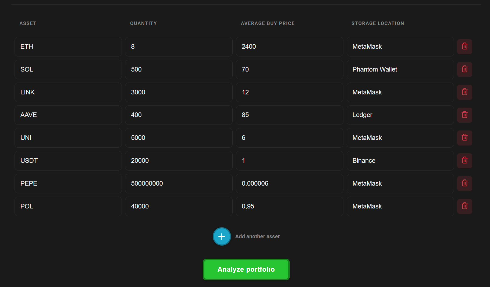
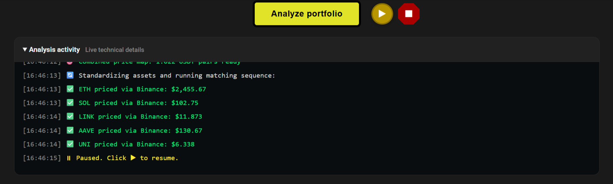
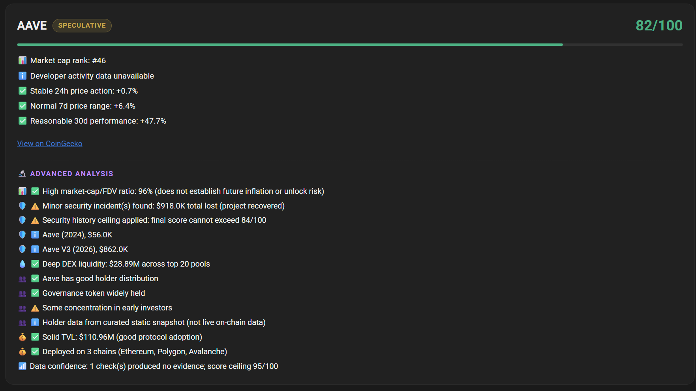
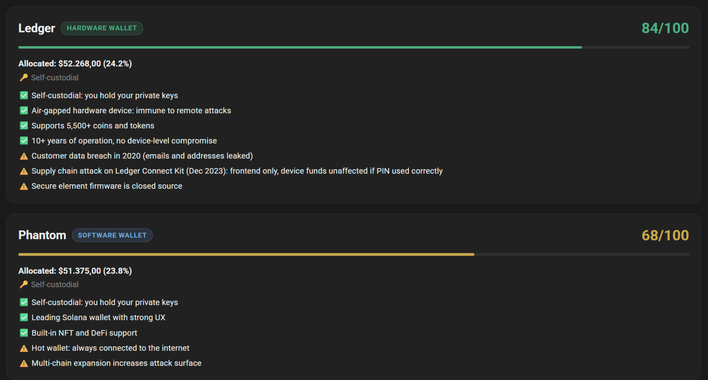
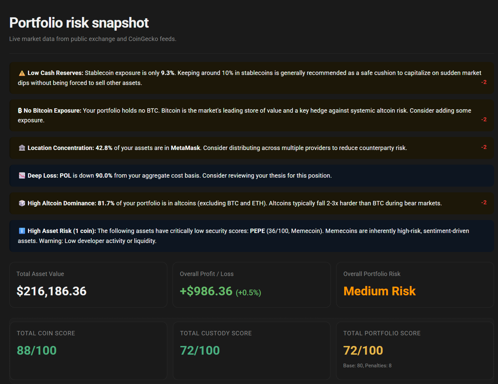
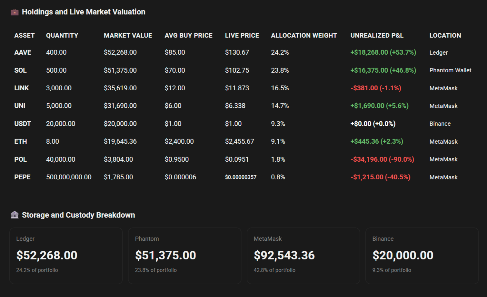
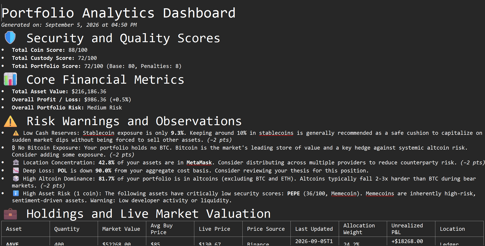

# Crypto Portfolio Risk Analyzer

**Understand what you hold, where you hold it, and which risks deserve a closer look.**

A portfolio's value tells only part of its story. Project fundamentals, security incidents, asset concentration, and the wallets or exchanges used for storage all affect its risk. Crypto Portfolio Risk Analyzer was built to bring those factors into one readable view, helping users review their holdings and identify questions worth investigating further.

Enter your positions, run an analysis, and explore a breakdown of asset quality, custody, valuation, and portfolio warnings. Each score comes with supporting observations, and the results can be exported as a Markdown report.

Built with **HTML, CSS, and vanilla JavaScript**, the app runs in your browser without an account, wallet connection, backend, or build step.

[Getting started](#getting-started) * [Features](#features) * [Understanding the scores](#understanding-the-scores) * [Built to evolve](#built-to-evolve) * [Disclaimer](#disclaimer)

## Getting started

1. Download or clone this repository.
2. Open [`Analyzer.html`](Analyzer.html) in a modern browser with an internet connection.
3. Enter each asset's symbol, quantity, average buy price in USD, and storage location—or load a demo portfolio.
4. Click **Analyze portfolio**, review the results, and export a report if you want to keep a copy.

## Features

> Screenshots illustrate example runs. Prices, scores, and some explanatory text reflect the version and data available when they were captured; current results may differ. See [Understanding the scores](#understanding-the-scores) for the current model's limitations.

### 1. Build a portfolio across multiple storage locations

Add and remove positions directly in the holdings table. The same asset can appear on multiple rows when it is split across wallets or exchanges, so the analysis can account for both asset exposure and storage concentration.

Demo portfolios cover conservative holdings, DeFi, memecoins, and stablecoins. Additional QA presets exercise cases such as unknown assets and missing prices. Dark and light themes let you choose how to view the results.

### 2. Follow the analysis as it runs

The expandable **Analysis activity** console shows price lookups, provider responses, analysis steps, and unavailable data. Pause and resume the workflow, or stop it when needed. Inputs stay locked during a run so the results correspond to the positions submitted at its start.

Market prices are requested from Binance, Bybit, and OKX, with CoinGecko used as a fallback. Analysis time depends on the number of unique assets and provider availability; bounded retries, timeouts, and caching help handle unreliable responses.

### 3. Inspect each coin's fundamentals and risk signals

Individual asset cards show a score alongside the observations behind it. The analysis combines two stages:

- **Fundamentals:** project age, market-cap rank, available developer activity, and price changes across several time windows.
- **Advanced checks:** supply and valuation metrics, recorded security incidents, DEX liquidity, holder-data availability, and matched protocol or chain TVL where applicable.

CoinGecko supplies project and market metadata, DeFiLlama supplies security-incident and TVL data, and GeckoTerminal supplies DEX pool liquidity data. A link to the resolved CoinGecko page helps you inspect the asset being analyzed.

Missing evidence is surfaced in the results. Holder-distribution notes are currently curated historical context, not live on-chain measurements, and do not contribute holder points to the score.

### 4. Review custody alongside asset quality

Custody cards group holdings by storage location and show the allocated value, portfolio share, custody type, and assessment notes. This helps distinguish the risks of an asset from those associated with the wallet or exchange holding it.

**The custody section is currently hardcoded:** scores and notes come from a manually maintained database in [`js/custody_analyzer.js`](js/custody_analyzer.js), rather than live audits. Unknown or ambiguous locations are marked as unverified and use a neutral placeholder, which should not be read as a verified assessment.

### 5. See the picture portfolio picture

The dashboard brings together total asset value, unrealized profit or loss, coin and custody scores, and an overall portfolio score. Warnings highlight conditions such as concentration in one location, high altcoin exposure, stablecoin related risks, deep losses, and low scoring assets.

Where a warning affects the portfolio score, its penalty is shown. Informational observations can appear without a deduction, helping distinguish a finding from its effect on the model.

### 6. Compare holdings and storage allocation

The detailed holdings table puts quantity, market value, average buy price, fetched price, allocation weight, unrealized P&L, and storage location side by side. A separate custody breakdown shows how much of the portfolio sits at each location.

### 7. Export a readable Markdown report

Download a `.md` snapshot containing the portfolio summary, warnings, holdings, custody breakdown, and detailed analysis. The report includes price source information and timestamps where available, plus score calculation details for closer review.

## Understanding the scores

Scores are **rule based estimates on a 0-100 scale**, not measured probabilities of safety or future performance. Higher values indicate fewer risks under the model's rules and available evidence.

| Result | What it represents |
| --- | --- |
| Fundamental Score | Value weighted Phase 1 scores after evidence and risk caps. The raw model average is displayed separately. |
| Total Coin Score | Each asset's raw fundamental score plus its advanced adjustment, constrained by applicable caps, then weighted by position value. |
| Total Custody Score | Value-weighted assessments of storage locations from the curated custody database. |
| Total Portfolio Score | The rounded average of coin and custody scores, minus applicable warning penalties, with a minimum of zero. |

The final coin calculation starts from the **raw** fundamental score, not the already capped Fundamental Score card. Custody is incorporated at the portfolio level. Overlapping penalties with the same underlying warning key are counted once, using the largest deduction.

Security incidents, asset profiles such as memecoins, and incomplete data can limit the maximum score. No matching hack record is not proof of safety, and missing developer metadata is not proof that a project was abandoned. TVL requires a matching CoinGecko entity ID, a matching ticker alone is insufficient. Supply ratios and historical holder notes do not establish future unlock risk or current ownership concentration.

## Data and privacy

Portfolio calculations run locally in the browser. Quantities, average buy prices, storage entries, and generated reports are not sent to a project backend. Asset identifiers are requested from public data services, and requests may pass through public CORS proxies when direct access fails. Those services receive the requested URLs and ordinary connection metadata.

The app uses browser `localStorage` for cached API data and theme preferences. It does not connect to wallets, request private keys, or execute trades. Live analysis needs network access, and rate limits, blocked requests, missing metadata, or cached responses can affect coverage and freshness.

## Built to evolve

The project is written with future changes in mind. Coin analysis, custody assessments, and portfolio alerts live in separate JavaScript modules, making it easier to update data sources, revise scoring rules, expand custody coverage, or add checks as the crypto ecosystem changes.

| File | Responsibility |
| --- | --- |
| [`Analyzer.html`](Analyzer.html) | Portfolio input, price retrieval, dashboard orchestration, and Markdown export. |
| [`js/coin_analyzer.js`](js/coin_analyzer.js) | Asset identification, fundamentals, advanced checks, caching, and coin scoring. |
| [`js/custody_analyzer.js`](js/custody_analyzer.js) | Storage-name normalization and curated custody assessments. |
| [`js/alerts.js`](js/alerts.js) | Portfolio warnings and penalty rules. |
| [`css/style.css`](css/style.css) | Layout, responsive styling, and themes. |

This structure supports adaptation through maintained code changes; it does not automatically validate provider changes or refresh hardcoded assessments.

Corrections, new custody entries, and improvements to the scoring model are welcome through issues or pull requests. Include supporting sources and a reproducible example when reporting an incorrect assessment.

## Conclusion

Crypto Portfolio Risk Analyzer turns a list of holdings into an explainable risk snapshot. Its purpose is to make portfolio structure, storage exposure, and gaps in available evidence easier to inspect, giving users a starting point for their own research. As data sources and risks change, the project can be maintained and extended to reflect them.

## Disclaimer

**This project is for educational and informational purposes only. Nothing in the application, its scores, reports, screenshots, or documentation constitutes financial or investment advice, or a recommendation to buy, sell, or hold any asset.**

Data and curated assessments may be incomplete, inaccurate, or outdated. A high score does not guarantee safety, and a low score does not predict a loss. Independently verify relevant information and make decisions based on your own circumstances and research. Use the tool at your own risk.

## License

Released under the [MIT License](LICENSE).
